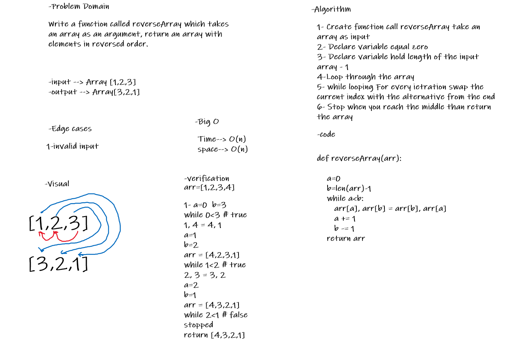

# Reverse an Array

Function takes an array as an argument, and return an array with elements in reversed order.

## Whiteboard Process

## Approach & Efficiency

Create function call reverseArray take an array as input, Declare new empty array, Declare variable hold length of the input arrau, loop form the end to the begining of the array, while looping append to the new empty array, return the new array

Big O Time--> O(n)

Big O space--> O(n)
